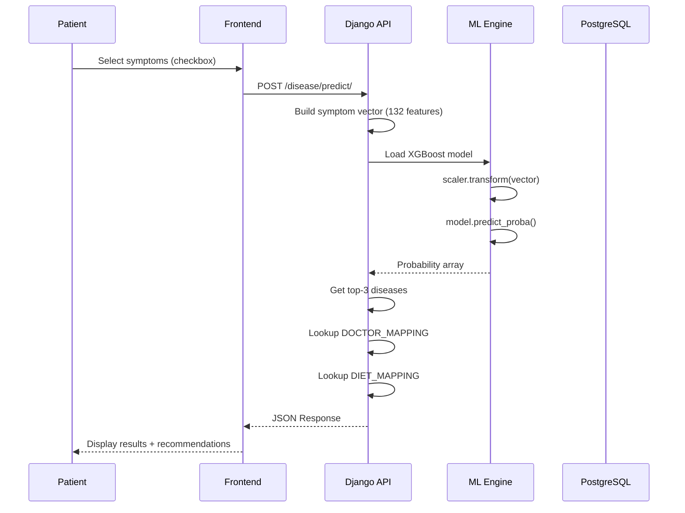
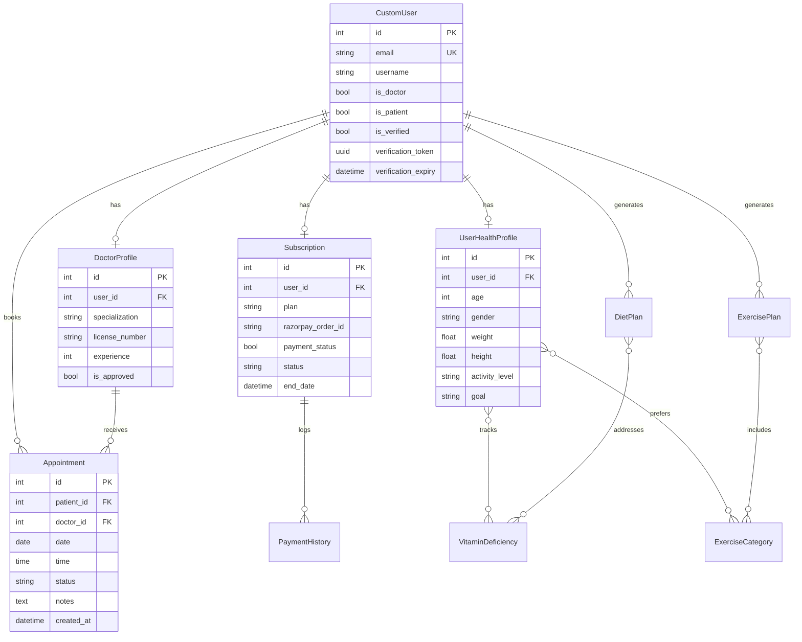

<p align="center">
  
</p>

<h1 align="center">🏥 MediCure Enhanced</h1>

<p align="center">
  <strong>AI-Powered Healthcare Management Platform</strong><br/>
  <em>Disease Prediction • Health Risk Assessment • Personalized Diet Plans • Appointment Scheduling</em>
</p>

<p align="center">
  
  
  
  
  
  
</p>

<p align="center">
  <a href="#-system-architecture">Architecture</a> •
  <a href="#-machine-learning-models">ML Models</a> •
  <a href="#-database-schema">Database</a> •
  <a href="#-api-endpoints">API</a> •
  <a href="#-quick-start">Setup</a>
</p>

---

## 📖 About

**MediCure Enhanced** is a production-ready healthcare platform that combines traditional patient-doctor appointment management with **4 machine learning models** for predictive health analytics. Built with Django REST Framework and containerized with Docker for seamless deployment.

### Key Capabilities

| Category | Features |
|:---------|:---------|
| **🩺 Disease Prediction** | XGBoost model trained on 132 symptoms, returns top-3 diagnoses with confidence scores |
| **🧠 Mental Health** | 17-feature assessment predicting conditions like Depression, Anxiety, Bipolar |
| **👩‍⚕️ PCOS Detection** | 15-parameter model for Polycystic Ovary Syndrome risk assessment |
| **⚖️ Obesity Analysis** | BMI-based classification with activity level correlation |
| **🥗 Personalized Plans** | Auto-generated diet plans with calorie targets and exercise routines |
| **📅 Appointments** | Full booking lifecycle: Request → Approve/Reject → Complete |
| **💳 Subscriptions** | Razorpay-integrated monthly/yearly plans with payment history |

---

## 🏗️ System Architecture

### High-Level Overview

```
┌─────────────────────────────────────────────────────────────────────────────┐
│                              CLIENT LAYER                                    │
│  ┌─────────────┐  ┌─────────────┐  ┌─────────────┐  ┌─────────────┐         │
│  │   Patient   │  │   Doctor    │  │    Admin    │  │  Mobile App │         │
│  │   Portal    │  │   Portal    │  │   Portal    │  │   (Future)  │         │
│  └──────┬──────┘  └──────┬──────┘  └──────┬──────┘  └──────┬──────┘         │
└─────────┼────────────────┼────────────────┼────────────────┼────────────────┘
          │                │                │                │
          ▼                ▼                ▼                ▼
┌─────────────────────────────────────────────────────────────────────────────┐
│                           APPLICATION LAYER (Docker)                         │
│  ┌─────────────────────────────────────────────────────────────────────────┐│
│  │                         Django 5.1 Application                          ││
│  │  ┌──────────┐ ┌──────────┐ ┌──────────┐ ┌──────────┐ ┌──────────┐      ││
│  │  │  Users   │ │ Doctors  │ │Appoint-  │ │  Health  │ │   Diet   │      ││
│  │  │  Module  │ │  Module  │ │  ments   │ │Prediction│ │ Planner  │      ││
│  │  └──────────┘ └──────────┘ └──────────┘ └──────────┘ └──────────┘      ││
│  │  ┌──────────┐ ┌──────────┐ ┌────────────────────────────────────┐      ││
│  │  │ Disease  │ │Subscrip- │ │         ML Engine (Pickle)         │      ││
│  │  │Prediction│ │  tions   │ │  XGBoost │ RandomForest │ Scalers  │      ││
│  │  └──────────┘ └──────────┘ └────────────────────────────────────┘      ││
│  └─────────────────────────────────────────────────────────────────────────┘│
│  ┌─────────────┐  ┌─────────────┐  ┌─────────────┐                          │
│  │  Gunicorn   │  │ WhiteNoise  │  │    JWT +    │                          │
│  │    WSGI     │  │   Static    │  │   Session   │                          │
│  └─────────────┘  └─────────────┘  └─────────────┘                          │
└─────────────────────────────────────────────────────────────────────────────┘
          │                                          │
          ▼                                          ▼
┌─────────────────────────┐              ┌─────────────────────────┐
│      DATA LAYER         │              │    EXTERNAL SERVICES    │
│  ┌───────────────────┐  │              │  ┌───────────────────┐  │
│  │    PostgreSQL     │  │              │  │   Gmail SMTP      │  │
│  │    Database       │  │              │  │   (Verification)  │  │
│  └───────────────────┘  │              │  └───────────────────┘  │
│  ┌───────────────────┐  │              │  ┌───────────────────┐  │
│  │   ML Models       │  │              │  │   Razorpay API    │  │
│  │   (.pkl files)    │  │              │  │   (Payments)      │  │
│  └───────────────────┘  │              │  └───────────────────┘  │
└─────────────────────────┘              └─────────────────────────┘
```

### Request Flow (Disease Prediction Example)



---

## 🧠 Machine Learning Models

### Model Registry

| Model | Algorithm | Features | Output | Accuracy |
|:------|:----------|:---------|:-------|:---------|
| **Disease Prediction** | XGBoost Classifier | 132 symptoms (binary) | 41 diseases + confidence | ~92% |
| **Mental Health** | Trained Classifier | 17 behavioral indicators | 7 conditions | ~85% |
| **PCOS Detection** | Binary Classifier | 15 health parameters | PCOS / No PCOS | ~88% |
| **Obesity Risk** | Classifier + Label Encoder | 6 metrics (BMI, activity) | 4 categories | ~90% |

### Disease Prediction Pipeline

```
Input: ["headache", "fever", "fatigue", "nausea"]
                    │
                    ▼
┌─────────────────────────────────────────────────────────┐
│  1. SYMPTOM VECTORIZATION                               │
│     symptoms_list = ['itching', 'skin_rash', ...]       │
│     vector = np.zeros(132)                              │
│     for symptom in input:                               │
│         vector[symptoms_list.index(symptom)] = 1        │
└─────────────────────────────────────────────────────────┘
                    │
                    ▼
┌─────────────────────────────────────────────────────────┐
│  2. FEATURE SCALING                                     │
│     scaled_vector = scaler.transform([vector])          │
└─────────────────────────────────────────────────────────┘
                    │
                    ▼
┌─────────────────────────────────────────────────────────┐
│  3. MODEL INFERENCE                                     │
│     probabilities = model.predict_proba(scaled_vector)  │
│     top_3 = argsort(probabilities)[-3:][::-1]          │
└─────────────────────────────────────────────────────────┘
                    │
                    ▼
Output: {
    "predicted_disease": "Typhoid",
    "confidence_score": "87.5%",
    "top_3_predictions": [("Typhoid", 87.5), ("Malaria", 8.2), ("Dengue", 4.3)],
    "recommended_doctors": ["Infectious Disease Specialist"],
    "recommended_diet": ["Hydrating foods", "Easy-to-digest meals"],
    "recommended_exercise": ["Complete bed rest", "Light walking when recovering"]
}
```

### Mental Health Assessment Features

```python
MENTAL_HEALTH_FEATURES = [
    "sadness",              # Scale 0-10
    "euphoric",             # Scale 0-10
    "exhausted",            # Scale 0-10
    "sleep_dissorder",      # Binary
    "mood_swing",           # Binary
    "suicidal_thoughts",    # Binary (CRITICAL)
    "anorxia",              # Binary
    "authority_respect",    # Scale 0-10
    "try_explanation",      # Scale 0-10
    "aggressive_response",  # Binary
    "ignore_move_on",       # Binary
    "nervous_break_down",   # Binary
    "admit_mistakes",       # Scale 0-10
    "overthinking",         # Binary
    "sexual_activity",      # Scale 0-10
    "concentration",        # Scale 0-10
    "optimisim"             # Scale 0-10
]

PREDICTED_CONDITIONS = [
    "Normal", "Depression", "Anxiety", "Bipolar Type 1",
    "Bipolar Type 2", "PTSD", "OCD"
]
```

---

## 📊 Database Schema

### Entity Relationship Diagram



### Appointment State Machine

```
┌─────────┐     Patient      ┌─────────┐     Doctor      ┌───────────┐
│ (Start) │ ──────────────▶ │ PENDING │ ──────────────▶ │ CONFIRMED │
└─────────┘    Requests      └─────────┘    Approves     └───────────┘
                                  │                            │
                                  │ Doctor                     │ After
                                  │ Rejects                    │ Visit
                                  ▼                            ▼
                            ┌──────────┐               ┌───────────┐
                            │ REJECTED │               │ COMPLETED │
                            └──────────┘               └───────────┘
                                  
                            ┌───────────┐
                            │ CANCELLED │ ◀── Patient/Doctor cancels
                            └───────────┘
```

---

## 🔌 API Endpoints

### Authentication & Users

| Method | Endpoint | Description | Auth | Request Body |
|:------:|:---------|:------------|:----:|:-------------|
| `POST` | `/users/signup/` | Register new user | ❌ | `{email, password, first_name, last_name, user_type}` |
| `POST` | `/users/api/login/` | JWT Login | ❌ | `{email, password}` |
| `GET` | `/users/verify-email/<token>/` | Verify email (10min expiry) | ❌ | - |
| `POST` | `/users/forgot-password/` | Request password reset | ❌ | `{email}` |
| `GET` | `/users/dashboard/` | User dashboard | ✅ | - |

### Disease Prediction

| Method | Endpoint | Description | Auth | Request/Response |
|:------:|:---------|:------------|:----:|:-----------------|
| `GET` | `/disease/predict/` | Get symptom list | ✅ | Response: `{symptoms: [...], possible_diseases: [...]}` |
| `POST` | `/disease/predict/` | Run prediction | ✅ | Request: `{symptoms: ["fever", "headache"]}` |

**Response Schema:**
```json
{
    "predicted_disease": "Typhoid",
    "confidence_score": "87.5%",
    "top_3_predictions": [
        ["Typhoid", 87.5],
        ["Malaria", 8.2],
        ["Dengue", 4.3]
    ],
    "recommended_doctors": ["Infectious Disease Specialist"],
    "recommended_diet": ["Hydrating foods", "Soft diet"],
    "recommended_exercise": ["Bed rest", "Light walking"]
}
```

### Health Risk Assessment

| Method | Endpoint | Description | Auth | Features |
|:------:|:---------|:------------|:----:|:---------|
| `POST` | `/health/mental-health/` | Mental health assessment | ✅ | 17 behavioral indicators |
| `POST` | `/health/pcos/` | PCOS risk prediction | ✅ | 15 health parameters |
| `POST` | `/health/obesity/` | Obesity classification | ✅ | Gender, Age, Height, Weight, BMI, Activity |

### Diet & Exercise Planning

| Method | Endpoint | Description | Auth |
|:------:|:---------|:------------|:----:|
| `GET` | `/exercise/planner/` | Health profile form | ✅ |
| `POST` | `/exercise/generate-plan/` | Generate personalized plans | ✅ |
| `GET` | `/exercise/diet-plan/` | View latest diet plan | ✅ |
| `GET` | `/exercise/exercise-plan/` | View latest exercise plan | ✅ |

**Diet Plan Response:**
```json
{
    "daily_calories": 2200,
    "bmi_category": "normal",
    "goal": "muscle_gain",
    "breakfast": [{"item": "Oatmeal", "calories": 300, "protein": 12}],
    "lunch": [...],
    "dinner": [...],
    "snacks": [...]
}
```

### Appointments

| Method | Endpoint | Description | Auth |
|:------:|:---------|:------------|:----:|
| `GET` | `/appointments/book/<doctor_id>/` | Booking form | 🧑‍🤝‍🧑 Patient |
| `POST` | `/appointments/book/<doctor_id>/` | Create appointment | 🧑‍🤝‍🧑 Patient |
| `GET` | `/appointments/my-appointments/` | Patient's appointments | 🧑‍🤝‍🧑 Patient |
| `GET` | `/appointments/doctor-appointments/` | Doctor's schedule | 👨‍⚕️ Doctor |
| `POST` | `/appointments/approve/<id>/` | Approve request | 👨‍⚕️ Doctor |
| `POST` | `/appointments/reject/<id>/` | Reject request | 👨‍⚕️ Doctor |

### Subscriptions (Razorpay)

| Method | Endpoint | Description | Auth |
|:------:|:---------|:------------|:----:|
| `POST` | `/subscriptions/create-order/` | Create Razorpay order | ✅ |
| `POST` | `/subscriptions/verify/` | Verify payment signature | ✅ |
| `GET` | `/subscriptions/status/` | View subscription status | ✅ |

**Subscription Plans:**
| Plan | Price (INR) | Features |
|:-----|:------------|:---------|
| Monthly | ₹50 | 5 consultations, Unlimited predictions, Basic reports |
| Yearly | ₹500 | Unlimited consultations, Priority support, Specialist access, Advanced reports |

---

## 📁 Project Structure

```
MedicureEnhanced/
├── 📄 README.md                      # This file
├── 📄 .gitignore                     # Git ignore rules
│
└── medicure/                         # Django Project Root
    ├── 🐳 Dockerfile                 # Container definition (Gunicorn)
    ├── 🐳 docker-compose.yml         # Multi-container orchestration
    ├── 📄 requirements.txt           # Python dependencies
    ├── 📄 manage.py                  # Django CLI
    │
    ├── medicure/                     # Project Configuration
    │   ├── settings.py               # DB, Email, Security, REST config
    │   ├── urls.py                   # Root URL router
    │   └── wsgi.py                   # Gunicorn entry point
    │
    ├── users/                        # 👤 Authentication Module
    │   ├── models.py                 # CustomUser (AbstractUser + verification)
    │   ├── views.py                  # Signup, Login, Dashboard, Password Reset
    │   ├── serializers.py            # JWT serializers
    │   └── urls.py                   # /users/* routes
    │
    ├── doctors/                      # 👨‍⚕️ Doctor Management
    │   ├── models.py                 # DoctorProfile (specialization, license)
    │   ├── views.py                  # Doctor listing, search
    │   └── urls.py                   # /doctors/* routes
    │
    ├── appointments/                 # 📅 Booking System
    │   ├── models.py                 # Appointment (5-status FSM)
    │   ├── views.py                  # Book, Approve, Reject, Cancel
    │   └── urls.py                   # /appointments/* routes
    │
    ├── disease_prediction/           # 🧠 ML Disease Prediction
    │   ├── disease_model_xgb.pkl     # Trained XGBoost model
    │   ├── train_xgboost.py          # Training script
    │   ├── views.py                  # Prediction API + recommendations
    │   └── urls.py                   # /disease/* routes
    │
    ├── health_prediction/            # 🩺 Health Risk Models
    │   ├── models/
    │   │   ├── mental_health_model.pkl
    │   │   ├── pcos_model.pkl
    │   │   └── obesity_model.pkl
    │   ├── datasets/                 # Training data CSVs
    │   ├── views.py                  # MentalHealthView, PCOSView, ObesityView
    │   └── urls.py                   # /health/* routes
    │
    ├── diet_exercise/                # 🥗 Personalized Planning
    │   ├── models.py                 # UserHealthProfile, DietPlan, ExercisePlan
    │   ├── services/                 # Business logic
    │   │   ├── diet_service.py       # Calorie calculation, meal generation
    │   │   └── exercise_service.py   # Exercise routine generation
    │   ├── views.py                  # Profile, Generate, Results views
    │   └── urls.py                   # /exercise/* routes
    │
    ├── subscriptions/                # 💳 Payment Module
    │   ├── models.py                 # Subscription, PaymentHistory
    │   ├── views.py                  # Razorpay create/verify
    │   └── urls.py                   # /subscriptions/* routes
    │
    ├── templates/                    # 🎨 Frontend (47 templates)
    │   ├── base.html                 # Master layout + toast notifications
    │   ├── navbar.html               # Responsive navigation
    │   ├── users/                    # Auth pages
    │   ├── disease_prediction/       # Symptom form + results
    │   ├── health_prediction/        # Assessment forms
    │   ├── diet_exercise/            # Planner UI
    │   └── appointments/             # Booking UI
    │
    └── static/                       # 📦 Assets
        ├── css/styles.css            # Custom styles
        └── images/                   # Logos, illustrations
```

---

## 🚀 Quick Start

### Prerequisites
- [Docker Desktop](https://www.docker.com/products/docker-desktop/) (v24+)
- Git

### 1. Clone & Configure

```bash
git clone https://github.com/2004Shivam/MedicureEnhanced.git
cd MedicureEnhanced/medicure

# Create environment file
cat > .env << EOF
POSTGRES_DB=medicure
POSTGRES_USER=medicure_user
POSTGRES_PASSWORD=super_secure_password
POSTGRES_HOST=db
POSTGRES_PORT=5432
DEBUG=True
SECRET_KEY=$(python -c 'import secrets; print(secrets.token_urlsafe(50))')
EMAIL_HOST_USER=your_email@gmail.com
EMAIL_HOST_PASSWORD=your_app_password
RAZORPAY_KEY_ID=your_razorpay_key
RAZORPAY_KEY_SECRET=your_razorpay_secret
EOF
```

### 2. Build & Run

```bash
# Start all services
docker compose up --build -d

# Run database migrations
docker compose exec web python manage.py migrate

# Create admin user
docker compose exec web python manage.py createsuperuser
```

### 3. Access

| Service | URL | Credentials |
|:--------|:----|:------------|
| 🌐 Web App | http://localhost:8000 | (Register new account) |
| 🔧 Admin Panel | http://localhost:8000/admin | (Superuser created above) |
| 🗄️ Database | localhost:5432 | medicure_user / super_secure_password |

---

## ☁️ Production Deployment

**Recommended Stack (Free Tier):**

| Component | Service | Notes |
|:----------|:--------|:------|
| Database | [Neon.tech](https://neon.tech) | Free PostgreSQL, never expires |
| App Hosting | [Render.com](https://render.com) | Free Docker hosting |
| Keep-Alive | [UptimeRobot](https://uptimerobot.com) | Prevents free-tier sleeping |

**Key Production Settings:**
```python
# medicure/settings.py
DEBUG = False
ALLOWED_HOSTS = ['your-app.onrender.com']
CSRF_TRUSTED_ORIGINS = ['https://your-app.onrender.com']
```

---

## 🤝 Contributing

1. Fork the repository
2. Create feature branch: `git checkout -b feature/AmazingFeature`
3. Commit changes: `git commit -m 'Add AmazingFeature'`
4. Push: `git push origin feature/AmazingFeature`
5. Open Pull Request

---

## 📜 License

This project is for educational purposes. See individual model training scripts for data attribution.

---

<p align="center">
  <strong>Built with ❤️ by Shivam</strong><br/>
  <em>© 2026 MediCure Enhanced</em>
</p>
