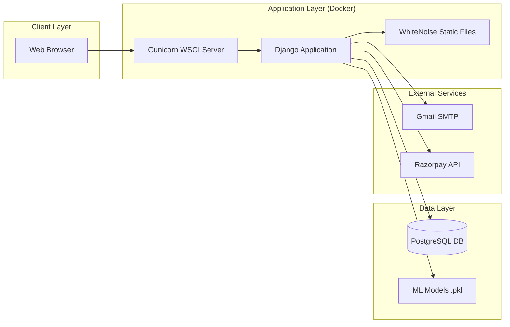
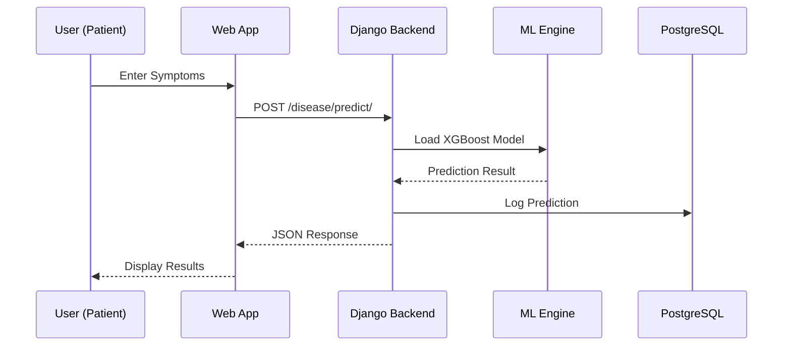

<p align="center">
  
</p>

<h1 align="center">🏥 MediCure Enhanced</h1>

<p align="center">
  <b>An AI-Powered, Dockerized Healthcare Management Platform</b>
</p>

<p align="center">
  
  
  
  
  
</p>

<p align="center">
  <a href="https://medicureenhanced.onrender.com"></a>
  
</p>

<p align="center">
  <a href="#-features">Features</a> •
  <a href="#-architecture">Architecture</a> •
  <a href="#-quick-start">Quick Start</a> •
  <a href="#-deployment">Deployment</a>
</p>

---

## 📖 Overview

**MediCure Enhanced** is a comprehensive, full-stack healthcare platform that combines robust patient-doctor management with cutting-edge **Machine Learning** for disease prediction and personalized health recommendations.

It is fully **containerized with Docker**, enabling instant setup and seamless deployment to any cloud platform.

---

## ✨ Features

<table>
<tr>
<td width="33%" align="center">
<h3>🧠 AI/ML Engine</h3>
<ul align="left">
<li>Disease Prediction (XGBoost)</li>
<li>Mental Health Risk Assessment</li>
<li>PCOS Prediction Model</li>
<li>Obesity Risk Analyzer</li>
<li>Smart Diet & Exercise Plans</li>
</ul>
</td>
<td width="33%" align="center">
<h3>👤 User Management</h3>
<ul align="left">
<li>JWT + Session Auth</li>
<li>Email Verification Flow</li>
<li>Role-Based Access (Patient/Doctor/Admin)</li>
<li>Secure Password Reset</li>
</ul>
</td>
<td width="33%" align="center">
<h3>📅 Appointments</h3>
<ul align="left">
<li>Doctor Discovery</li>
<li>Slot Booking System</li>
<li>Accept/Reject Workflow</li>
<li>Email Notifications</li>
</ul>
</td>
</tr>
</table>

---

## 🏗️ Architecture

### High-Level System Architecture



### Application Flow



---


## 🚀 Quick Start

### Prerequisites

*   [Docker Desktop](https://www.docker.com/products/docker-desktop/)
*   Git

### Installation

```bash
# 1. Clone the repository
git clone https://github.com/2004Shivam/MedicureEnhanced.git
cd MedicureEnhanced/medicure

# 2. Create environment file
cp .env.example .env  # Then edit with your credentials

# 3. Build and run with Docker
docker compose up --build

# 4. In a new terminal, run migrations
docker compose exec web python manage.py migrate

# 5. Create superuser
docker compose exec web python manage.py createsuperuser
```

### Access

| Service | URL |
|:--------|:----|
| 🌐 Web App | [http://localhost:8000](http://localhost:8000) |
| 🔧 Admin Panel | [http://localhost:8000/admin](http://localhost:8000/admin) |

### 🛠️ Troubleshooting

**Issue: `ModuleNotFoundError: No module named 'pkg_resources'`**
- This is due to `setuptools` removing `pkg_resources` in recent versions.
- **Fix:** Ensure `Dockerfile` pins `setuptools==69.5.1`.

**Issue: `psycopg2.OperationalError: server does not support SSL`**
- Occurs when running locally with `DEBUG=True`.
- **Fix:** `settings.py` is configured to only require SSL when `DEBUG=False` (Production). ensure your `.env` has `DEBUG=True` for local development.

---

## ☁️ Deployment

This project is optimized for **free-tier cloud deployment**:

| Component | Service | Cost |
|:----------|:--------|:----:|
| **Database** | [Neon.tech](https://neon.tech) | Rs.0 |
| **Application** | [Render.com](https://render.com) | Rs.0 |
| **Keep-Alive** | [UptimeRobot](https://uptimerobot.com) | Rs.0 |

See `deployment_plan.md` for step-by-step instructions.

---

## 🛠️ Tech Stack

<table>
<tr>
<td align="center" width="20%"><br/><b>Python 3.12</b></td>
<td align="center" width="20%"><br/><b>Django 5.1</b></td>
<td align="center" width="20%"><br/><b>PostgreSQL</b></td>
<td align="center" width="20%"><br/><b>Docker</b></td>
<td align="center" width="20%"><br/><b>TailwindCSS</b></td>
</tr>
</table>

---

## 🤝 Contributing

Contributions are welcome! Please follow these steps:

1.  **Fork** the repository
2.  **Create** a feature branch (`git checkout -b feature/AmazingFeature`)
3.  **Commit** your changes (`git commit -m 'Add AmazingFeature'`)
4.  **Push** to the branch (`git push origin feature/AmazingFeature`)
5.  **Open** a Pull Request

---

<p align="center">
  Built with ❤️ by <b>Shivam</b> | © 2026
</p>
